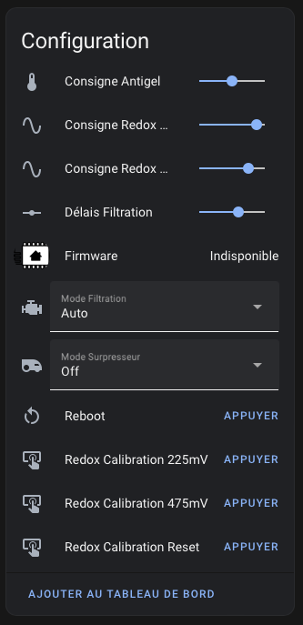

# FrangiPool

FrangiPool est un projet expérimental de domotisation de piscine sur base ESP32.
Vous trouverez ici la configuration **ESPHome** de FrangiPool.

Vous trouverez [le PCB ici](https://github.com/frangipool/pcb)

## I/O utilisés

* **GPIO25** : Pompe de filtration
* **GPIO26** : Surpresseur (optionnel)
* **GPIO27** : Contact sec de l'electrolyseur
* **2 sondes 1wire DS18B20** : une pour le local et une dans la canalisation de piscine
* **AN0** : Relevé RedOX via phidgets 1130
* **AN1** : Relevé pH via phidgets 1130 (optionnel)

## Choix de la configuration

| configuration | Filtration | Surpresseur | Electrolyseur | Température Local | Température Eau (avec fonction antigel) | Redox | pH |
|:-:|:-:|:-:|:-:|:-:|:-:|:-:|:-:|
| [frangipool_salt_without_ph.yaml](frangipool_salt_without_ph.yaml) | X | X | X | X | X | X | - |

## Installation

## Configuration

Une fois votre FrangiPool enregistré dans HomeAssistant vous accéder à un ensemble d'éléments de configuration, ces éléments peuvent varier en fonction de votre configuration.

* **Consigne Antigel** : température de consigne de la fonction Antigel de la piscine. Le déclenchement de la filtration se fait 1 degrés en dessous de la consigne (ex. : pour une consigne à 0°C, la filtration se déclenchera à -1°C et s'arrêtera à 0°C). La température prise en compte est celle de la canalisation.
* **Consigne Redox Max** : valeur Redox en mV au dela de laquelle la production de désinfectant s'arrête
* **Consigne Redox Min** : valeur Redox en mV en dessous de laquelle la production de désinfectant démarre
* **Délais Filtration** : temps de filtration minimum en minutes avant d'enregistrer les valeurs de température de l'eau et de Redox de la piscine, permet d'avoir des valeurs cohérente pour la température de l'eau et le Redox qui sont généralement mesurés dans les canalisations
* **Mode Filtration** : Auto, Off, On 24h ou Hiver
* **Mode Surpresseur** : Off, Auto ou Forcé
* **Reboot** : redémarre l'ESP
* **Redox Calibration 225mV** : permet de calibrer la sonde dans une solution 225mV
* **Redox Calibration 475mV** : permet de calibrer la sonde dans une solution 475mV
* **Redox Calibration Reset** : remet l'offset de calibration à 0
